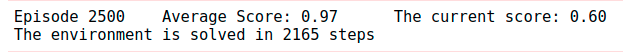
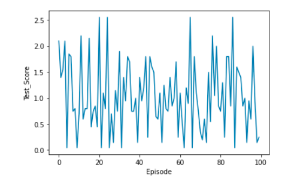

[//]: # (Image References)

[image1]: https://user-images.githubusercontent.com/10624937/42135623-e770e354-7d12-11e8-998d-29fc74429ca2.gif "Trained Agent"
[image2]: https://user-images.githubusercontent.com/10624937/42135622-e55fb586-7d12-11e8-8a54-3c31da15a90a.gif "Soccer"

# Project 3: Collaboration and Competition

### Introduction

In this project, we trained a MADDPG network [1] for making two tennis rackets playing with each others. The code is based on the DDPG implementation code from Udacity [2].
The working environment is the [Tennis](https://github.com/Unity-Technologies/ml-agents/blob/master/docs/Learning-Environment-Examples.md#tennis) environment.

![Trained Agent][image1]

In this environment, two agents control rackets to bounce a ball over a net. If an agent hits the ball over the net, it receives a reward of +0.1.  If an agent lets a ball hit the ground or hits the ball out of bounds, it receives a reward of -0.01.  Thus, the goal of each agent is to keep the ball in play.

The observation space consists of 8 variables corresponding to the position and velocity of the ball and racket. Each agent receives its own, local observation.  Two continuous actions are available, corresponding to movement toward (or away from) the net, and jumping. 

The task is episodic, and in order to solve the environment, your agents must get an average score of +0.5 (over 100 consecutive episodes, after taking the maximum over both agents). Specifically,

- After each episode, we add up the rewards that each agent received (without discounting), to get a score for each agent. This yields 2 (potentially different) scores. We then take the maximum of these 2 scores.
- This yields a single **score** for each episode.

The environment is considered solved, when the average (over 100 episodes) of those **scores** is at least +0.5.

### Getting Started

1. Download the environment from one of the links below.  You need only select the environment that matches your operating system:
    - Linux: [click here](https://s3-us-west-1.amazonaws.com/udacity-drlnd/P3/Tennis/Tennis_Linux.zip)
    - Mac OSX: [click here](https://s3-us-west-1.amazonaws.com/udacity-drlnd/P3/Tennis/Tennis.app.zip)
    - Windows (32-bit): [click here](https://s3-us-west-1.amazonaws.com/udacity-drlnd/P3/Tennis/Tennis_Windows_x86.zip)
    - Windows (64-bit): [click here](https://s3-us-west-1.amazonaws.com/udacity-drlnd/P3/Tennis/Tennis_Windows_x86_64.zip)
    
    (_For Windows users_) Check out [this link](https://support.microsoft.com/en-us/help/827218/how-to-determine-whether-a-computer-is-running-a-32-bit-version-or-64) if you need help with determining if your computer is running a 32-bit version or 64-bit version of the Windows operating system.

    (_For AWS_) If you'd like to train the agent on AWS (and have not [enabled a virtual screen](https://github.com/Unity-Technologies/ml-agents/blob/master/docs/Training-on-Amazon-Web-Service.md)), then please use [this link](https://s3-us-west-1.amazonaws.com/udacity-drlnd/P3/Tennis/Tennis_Linux_NoVis.zip) to obtain the "headless" version of the environment.  You will **not** be able to watch the agent without enabling a virtual screen, but you will be able to train the agent.  (_To watch the agent, you should follow the instructions to [enable a virtual screen](https://github.com/Unity-Technologies/ml-agents/blob/master/docs/Training-on-Amazon-Web-Service.md), and then download the environment for the **Linux** operating system above._)

2. Place the file in the DRLND GitHub repository, in the `p3_collab-compet/` folder, and unzip (or decompress) the file. 

3. Follow the steps in the original [DRLND repository](https://github.com/udacity/deep-reinforcement-learning#dependencies)  to download the required dependencies and set up an Anaconda environment with Python = 3.6. CAUTION: The python version must be `3.6` to avoid any confliction with the Unity Agent version of `0.4.0`. 

### Instructions

Follow the instructions in `Tennis.ipynb` to get started with training your own agent. You can also run a pre-trained agent to evaluate its performance.

Some important files:
* `Tennis.ipynb` --> The training and testing process.
* `Plotting.ipynb` --> For plotting
* `MADDPG_Agent.py` --> The MADDPG agent that handles the learning process.
* `MADDPG_model.py` --> The MMDPPG Network architecture.
* `checkpoint_actor_1` --> The pre-trained parameters of the DDPG actor 1
* `checkpoint_critic_1` --> The pre-trained parameters of the DDPG critic 1
* `checkpoint_actor_0` --> The pre-trained parameters of the DDPG actor 0
* `checkpoint_critic_0` --> The pre-trained parameters of the DDPG critic 0
* `Final_model` --> The final trained model
* `REPORT.md` --> The report for this project.

### Training result

The environment is solved in 2165 episode. The highest score the agent attained is 2.5. 

### Testing score
In order to test the behavior of the trained agent, a testing process with 100 episode is executed. As can be seen from the graph below, the scores are very noisy. Hence the average score is around `0.61`. When watching the agent plays in the GUI, we see the two paddles averagely hit and hold the ball on the ground for around 4-5 steps. 

# References

* [1] Lowe et. al. [*Multi-Agent Actor-Critic for Mixed Cooperative-Competitive Environments*](https://arxiv.org/pdf/1706.02275.pdfs)
* [2] [DDPG implementation from Udacity](https://github.com/udacity/deep-reinforcement-learning/tree/master/ddpg-pendulum)