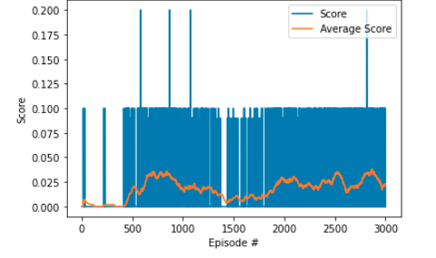
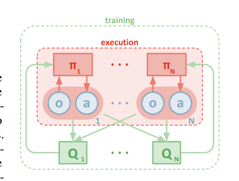

[//]: # (Image References)

[image1]: https://user-images.githubusercontent.com/10624937/43851024-320ba930-9aff-11e8-8493-ee547c6af349.gif "Trained Agent"
# Project Report: Continuous Control using Deep Deterministic Policy Gradient

## This report contains the following chapter:
* [Introduction](#Introduction)
* [Task Description](#Task-Description)
* [Algorithm](#Algorithm)
* [Implementation](#Implementation)
* [Further Development](#Further-Development)

## Introduction

In the recent years, Reinforcement Learning (RL) is a viral topic that has been researched and developed to solved various problem in the real world. In this project, we implemented a multi-agent RL methods namely `Multi-agent Deep Deterministic Policy Graditn` for training two players to be mutually collaborative and competitive in playing tennis. 

## Task description
### Given
![Trained Agent][image1]

The environment is considered solved, when the average (over 100 episodes) of those **scores** is at least +0.5.

* In this environment, two agents control rackets to bounce a ball over a net. 
* If an agent hits the ball over the net, it receives a reward of +0.1.  If an agent lets a ball hit the ground or hits the ball out of bounds, it receives a reward of -0.01.
* The observation space consists of 8 variables corresponding to the position and velocity of the ball and racket (2 states for 2 rackets)
* Each agent receives its own, local observation.  Two continuous actions are available, corresponding to movement toward (or away from) the net, and jumping. 
* Every entry in the action vector should be a number between -1 and 1.

### Goal
* Train the agent to maintain the ball in play as long as possible.

* After each episode, we add up the rewards that each agent received (without discounting), to get a score for each agent. This yields 2 (potentially different) scores. We then take the maximum of these 2 scores.

* This yields a single **score** for each episode. The environment is considered solved, when the average (over 100 episodes) of those average scores is at least +0.5. 

## Algorithm
To solve this problem, we implement the Multi-Agent Deep Deterministic Gradient Policy (MADDPG) mention in [3]. In that paper, they proposed a modification to the original DDPG [1] [2] to solve a RL problem in a multi-agent environment.  

Basically, this algorithm is based on DDPG mentioned in [1]. However in the vanila DDPG, only one agent is considered. Hence, intuitively, for a multi-agent environment, we can create different independent DDPG agents for each players. We have test it and the performance is very bad as shown below.



Another possible approach is to use one agent for two players. Each player will update this common agent based on its on observation. As shown below, the result is optimistic although the environment has not been solved yet.


However, that method also has some drawbacks as the players have to simultaneously compete and collaborate to each other. Hence, the reward of one player maybe the penalty of another player. The MADDPG alogrithm solve this problem by using the decentralized actor, centralized critic approach as shown below. 



In short, each agent policy will choose the action based on its local observation. However, these agents will share the same Q_value function, which then be used for evaluation and training for each agent's policy. 

## Implementation

To implement the aformentioned algorithm to this project, we re-used the implementation of DDPR from Udacity [4] with some modifications. 

### DDPR Model

Aformentioned, the MADDPG is based on the vanila DDPG which contains four networks for each agent. Two for actors and two for critics. However, in this project, the structure of those four networks are rather similiar with 1 input layer, 2 hidden layer and 1 output layer. The implementation of those models are stored in `MADDPR_Model.py`.

#### Actor model 

```python
class MA_Actor(nn.Module):
    """Actor (Policy) Model."""

    def __init__(self, state_size, action_size, seed, fc1_units=256, fc2_units = 128):
        super(MA_Actor, self).__init__()
        self.seed = torch.manual_seed(seed)
        self.batchnorm_input = nn.BatchNorm1d(state_size)
        self.fc1 = nn.Linear(state_size, fc1_units)
        self.batchnorm_fc1 = nn.BatchNorm1d(fc1_units)
        self.fc2 = nn.Linear(fc1_units, fc2_units)
        self.batchnorm_fc2 = nn.BatchNorm1d(fc2_units)
        self.fc3 = nn.Linear(fc2_units, action_size)
        self.reset_parameters()

    def reset_parameters(self):
        self.fc1.weight.data.uniform_(*hidden_init(self.fc1))
        self.fc2.weight.data.uniform_(*hidden_init(self.fc2))
        self.fc3.weight.data.uniform_(-3e-3, 3e-3)

    def forward(self, state):
        """Build an actor (policy) network that maps states -> actions."""
        x = self.batchnorm_input(state)
        x = F.relu(self.batchnorm_fc1(self.fc1(x)))
        x = F.relu(self.batchnorm_fc2(self.fc2(x)))
        return F.tanh(self.fc3(x))
```

As shown, the DNN of the Actor model has 4 layers: input layer (24), 2 hidden layers (256x128) and 1 output layer (2). We use the batch normalization for the input of each layers to reduce the training time and decrease the internal variance shift effect. Layer 1 and layer 2 is activated by Relu functions while the last layer used tanh function.   

#### Critic model 

```python
class MA_Critic(nn.Module):
    """Critic (Value) Model."""

    def __init__(self, state_size, action_size, seed, fcs1_units=128, fc2_units=128):
        super(MA_Critic, self).__init__()
        self.seed = torch.manual_seed(seed)
        self.batchnorm_input = nn.BatchNorm1d(state_size)
        self.fcs1 = nn.Linear(state_size, fcs1_units)
        self.fc2 = nn.Linear(fcs1_units+action_size, fc2_units)
        self.fc3 = nn.Linear(fc2_units, 1)
        self.reset_parameters()

    def reset_parameters(self):
        self.fcs1.weight.data.uniform_(*hidden_init(self.fcs1))
        self.fc2.weight.data.uniform_(*hidden_init(self.fc2))
        self.fc3.weight.data.uniform_(-3e-3, 3e-3)

    def forward(self, state, action):
        """Build a critic (value) network that maps (state, action) pairs -> Q-values."""
        xs = self.batchnorm_input(state)
        xs = F.leaky_relu(self.fcs1(xs))
        x = torch.cat((xs, action), dim=1)
        x = F.leaky_relu(self.fc2(x))
        return self.fc3(x)
```

At the first glance, the Critic model is a little bit similar to the Actor model. However, the size of the layers are different. The state value (after a Batch Normalization) is first processed in the first FCN and then concatinated with the action value in the second layer. The concatination value then goes through the second FCN and the third FCN. Finally, the Q_value of the action-state pair is given as the output of those layers.

The state_size of this Critic model is actually the joint state size of the agents `(joint_state_size = state_size_for_each_agent * num_agent)`. The same is true for the action_size parameter.
### DQN Learning Agent

The whole learning agent code is placed in the file `<ADDPG_AGent.py` This is also based on the DDPR Implementation from Udacity [3]. The agent is considered as a class called DQN_agent with some important functions:
* Joint Q_network: Each agent has two kinds of network: Q_network (critic) and policy_network (actor). While the poilicy network are private for each agent, the Q_network are shared among these agents. The shared Q_network contains the information about the observations and actions of each agent. It is initialized as:
```python 
self.critic_local = [MA_Critic(num_agents*state_size, num_agents*action_size, random_seed).to(device) for _ in range(num_agents)]
```
* step: Update the networks of the agent based on the given experience from the environment. This experience is also added to the memory `ReplayBuffer` for further randomly sample process. 
* act: Return an appropriate action based on the given state of the environment. Each agent used its own policy network for choosing the action. 
* learn: The learning process is strictly follow the `MADDPG algorithm` Algorithm described in [3]. In this function, the critic network is updated based on minizing the loss:


while the actor network for each agent is updated based on the following gradient:


* ReplayBuffer: To avoid the correlation between two consecutive action and state, the method of Experience Replay is introduced. By using step function, the experiences of the agent is stored in the ReplayBuffer. After that, the agent randomly choose a batch of expriences from this buffer and learn form them. 
* OU Noise: To add some randomness to the action of the arm, the Ornstein–Uhlenbeck noise model is implmented as function `OUNoise`.
* Gradient Clipping used for stabilizing the critic model training. `CAUTION` This method is very important as it not only enhance the stability of the model but also increase the training speed.
```torch.nn.utils.clip_grad_norm_(self.critic_local.parameters(), 1)```
* soft_update: After each learning step, the target network is updated based on the value of the local network. However, instead of discarding all of the old values, a soft update function is implemented to combine the weighted old_value and new_value together. This will help to stabilize the training process. The function is as followed.


### Training Routine
The training routine is based on the algorithm as in [3]. and the implementation code from Udacity [4]. The training procedure is implemented in the notebook `Tennis.ipynb` as followed.

```python
def MADDPG_Learning(num_episode = 2500, max_t = 1000, eps=1.0, eps_linear_decay=5e-6, eps_min=0.1):
    scores_windows = deque(maxlen = 100)
    scores_array = []
    print_every =  100
    solved_in = 0
    timer1 = pb.ProgressBar(widgets=widget1, maxval=num_episode).start()
    for i_episode in range(1, num_episode+1):
        
        timer1.update(i_episode)
        env_info = env.reset(train_mode=True)[brain_name]     # reset the environment    
        states = env_info.vector_observations                  # get the current state (for each agent)
        scores = np.zeros(num_agents)                          # initialize the score (for each agent)

        agent.reset()                                         # Important: Reset the noise value
        for t in range(max_t):
            actions = agent.act(states, eps)
            env_info = env.step(actions)[brain_name]           # send all actions to tne environment
            next_states = env_info.vector_observations         # get next state (for each agent)
            rewards = env_info.rewards                         # get reward (for each agent)
            dones = env_info.local_done                        # see if episode finished
                
            agent.step(states, actions, rewards, next_states, dones)
            
            scores += env_info.rewards                         # update the score (for each agent)
            eps = max(eps_min, eps - eps_linear_decay)
            states = next_states                               # roll over states to next time step
            
            if np.any(dones):                                  # exit loop if episode finished
                break
            
        max_current_score = np.max(scores)
        scores_windows.append(max_current_score)
        scores_array.append(max_current_score)
        if (i_episode % print_every == 0):
            for i in range(num_agents):
                torch.save(agent.actor_local[i].state_dict(), 'checkpoint_actor_{}.pth'.format(i))
                torch.save(agent.critic_local[i].state_dict(), 'checkpoint_critic_{}.pth'.format(i))
            torch.save(scores_array, 'score.pth')
            torch.save(i_episode, 'i_episode')
            print('\rEpisode {}\tAverage Score: {:.2f}\t The current score: {:.2f}'.format(i_episode, np.mean(scores_windows),max_current_score))   
        if (np.mean(scores_windows)>= 0.5 and i_episode>=100 and not solved_in):
            print('The environment is solved in {} steps and average score is: {}'.format(i_episode, np.mean(scores_windows)))
            for i in range(num_agents):
                torch.save(agent.actor_local[i].state_dict(), 'checkpoint_actor_solved_{}.pth'.format(i))
                torch.save(agent.critic_local[i].state_dict(), 'checkpoint_critic_solved_{}.pth'.format(i))
            solved_in = i_episode    
            #break
    print('The environment is solved in {} steps'.format(solved_in))
    timer1.finish()
    return scores_array     

score = MADDPG_Learning(max_t = 1000)

```

The learning procedure for each episode begins with the reset of the environment, the reset of the agent and the initial global state is observed. For each time step, an appropriate action is calculated by the agent based on the given state. Then, the agent used the tuple (state, action, reward, next_state, done) of each arms to update the weights of the neural network. In the end of each episode, the average max score is calculated and appended to the running score window of length 100. If the mean value of this score window is greater than 0.5, the problem is considered as solved and vice versa. 
 
### Hyperparameter

The some hyperameter are set in the file `MADDPG_agent.py` and described as follow:

```python
BUFFER_SIZE = int(1e6)  # replay buffer size
BATCH_SIZE = 256        # minibatch size
GAMMA = 0.99            # discount factor
TAU = 1e-3              # for soft update of target parameters
LR_ACTOR = 4e-4         # learning rate of the actor 
LR_CRITIC = 8e-4        # learning rate of the critic
WEIGHT_DECAY = 0  # L2 weight decay 0.001
UPDATE_EVERY = 1       # Update after t-step
NUM_UPDATE = 1          # Number of updates per step  
```

## Result

After having set up and installed all the require packages as mentioned in the file `README.md`, the evaluation process of agent can be started by running the notebook `Tennis.ipynb`.

### Training score

We have tried several times for finding the most suitable setting and parameter for this project. 


As shown in the plot, the 1500 first episodes of the training phase is very sparse due to the randomness of the environment and the short length of the episode. After 1800 episode, the agent started getting some useful information and the scores start increasing. The environment is solved in 2165 episode. The highest score the agent attained is 2.5. 


### Testing score
In order to test the behavior of the trained agent, a testing process with 100 episode is executed. As can be seen from the graph below, the scores are very noisy. Hence the average score is around `0.61`. When watching the agent plays in the GUI, we see the two paddles averagely hit and hold the ball on the ground for around 4-5 steps. 


# Further Development

Some developments could be made to enhance the performance of this project:

* Try different networks to see the effect of larger network. 
* Develop a new model but with the same agent and training process to solve the challenge of "Soccer". 
* Implement and test some others algorithm such as PPO or SAC. 

# References

* [1] Lillicrap et. al.. [*Continuous control through deep reinforcement learning*](https://arxiv.org/pdf/1509.02971.pdf)
* [2] Silver et. al.. [*Deterministic Policy Gradients Algorithms*](http://proceedings.mlr.press/v32/silver14.pdf)
* [3] Lowe et. al. [*Multi-Agent Actor-Critic for Mixed Cooperative-Competitive Environments*](https://arxiv.org/pdf/1706.02275.pdfs)
* [4] [DDPG implementation from Udacity](https://github.com/udacity/deep-reinforcement-learning/tree/master/ddpg-pendulum)